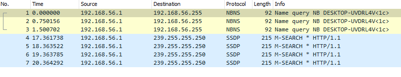
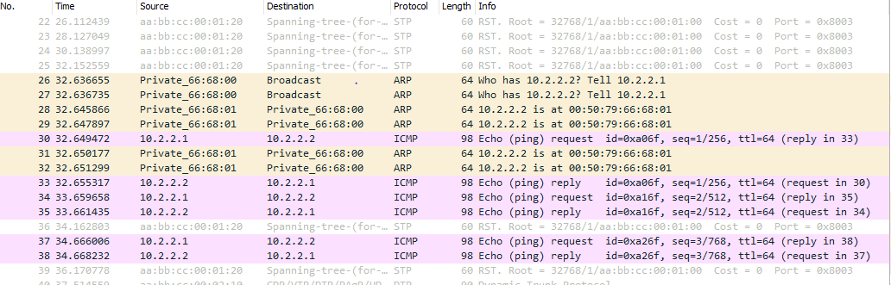
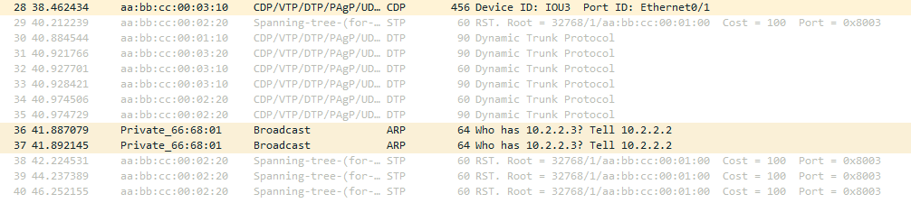

# Six-reseau-TP2

## Simplest setup
* 🌞Faire communiquer les deux PCs
avec un ping et déterminer le protocole utilisé par ping à l'aide de Wireshark
```
PC1> ping 10.2.1.2
84 bytes from 10.2.1.2 icmp_seq=1 ttl=64 time=1.803 ms    
PC2> ping 10.2.1.1
84 bytes from 10.2.1.1 icmp_seq=1 ttl=64 time=3.699 ms
```


* 🌞 récapituler toutes les étapes

## More switches

```
PC1> ping 10.2.2.2
84 bytes from 10.2.2.2 icmp_seq=1 ttl=64 time=28.365 ms

PC1> ping 10.2.2.3
84 bytes from 10.2.2.3 icmp_seq=1 ttl=64 time=4.049 ms


PC2> ping 10.2.2.1
84 bytes from 10.2.2.1 icmp_seq=1 ttl=64 time=4.886 ms

PC2> ping 10.2.2.3
84 bytes from 10.2.2.3 icmp_seq=1 ttl=64 time=5.147 ms

PC3> ping 10.2.2.1
84 bytes from 10.2.2.1 icmp_seq=1 ttl=64 time=11.604 ms

PC3> ping 10.2.2.2
84 bytes from 10.2.2.2 icmp_seq=1 ttl=64 time=13.924 ms
```
* 🌞 analyser la table MAC d'un switch
```
IOU1#show mac address-table
          Mac Address Table
-------------------------------------------
Vlan    Mac Address       Type        Ports
----    -----------       --------    -----
   1    0050.7966.6800    DYNAMIC     Et0/1
   1    0050.7966.6801    DYNAMIC     Et0/0
   1    aabb.cc00.0210    DYNAMIC     Et0/1
Total Mac Addresses for this criterion: 3
```
Table MAC de switch1 aprés le ping entre pc1 et pc3  
1ere ligne --> adresse MAC de pc3  
2eme ligne --> adresse MAC de pc1  
1ere ligne --> adresse MAC de switch 2  

Probleme pour ping mes PCs:  
screen depuis pc1
```
...
queue is full
queue is full
10.2.2.2 icmp_seq=2 timeout
10.2.2.2 icmp_seq=3 timeout

PC1> ping 10.2.2.2
84 bytes from 10.2.2.2 icmp_seq=1 ttl=64 time=1.207 ms
10.2.2.2 icmp_seq=2 timeout
10.2.2.2 icmp_seq=3 timeout
10.2.2.2 icmp_seq=4 timeout

PC1> ping 10.2.2.3
10.2.2.3 icmp_seq=1 timeout
```

* 🐙 en lançant Wireshark sur les liens des switches, il y a des trames CDP qui circulent. Quoi qu'est-ce ?



* 🌞 déterminer les informations STP
- root bridge (RB)

- election du Root Port (RP)

```
- Switch2 
Et0/1               Root FWD 100       128.2    Shr
```   
```
- switch3 
Et0/2               Root FWD 100       128.3    Shr
```  

- port en état bloquant (BLK)
```
- switch3
Et0/1               Altn BLK 100       128.2    Shr

```

- Negociation pour determiner les port en etat de forwarding (FWD)  
Tout le reste des ports est en état de forwarding

* Schema 
```
+-----------+                                                +---------------+
|  PC1      |                                                |  PC2          |
|           +-----------+                       +------------+               |
+-----------+           |                       |            +---------------+
                        |FWD                    |FWD
                      +----+                 +----+
            Route     | SW1+-----------------+ SW2|
            Bridge    |    |FWD          ROOT|    |
                      +----+                 +----+
                         |FWD                  |FWD
                         |                     |
                         |                     |
                         |                     |
                         |                     |
                         |      +----+         |
                         +------+ SW3+---------+
                            ROOT|    |BLK
                                +----+
                                  |FWD
                                  |
                                  |
                                  |
                                  |
                                  |
                                  |
                         +--------+--------+
                         |  PC3            |
                         |                 |
                         +-----------------+
```

- 🌞 confirmer les informations STP
ping effectué entre pc2 et pc3
entre IOU2 et IOU3 :  
 
entre IOU2 et IOU1 : 


- 🌞 ainsi, déterminer quel lien a été désactivé par STP  
 c'est le lien entre IOU2 et IOU3 qui est désactivé. 

 - 🌞 faire un schéma qui explique le trajet d'une requête ARP lorsque PC1 ping PC3, et de sa réponse
 ```  
    +-----------+                                                +---------------+
    |  PC1      |                                                |  PC2          |
    |           +-----------+                       +------------+               |
    +-----------+           |                       |            +---------------+
Ping pc1 vers pc3+-----+   |                       |
                        | +-+--+                 +--+-+
                        v | SW1+-----------------+ SW2|
      ou est l'ip 10.2.2.3|    | +---------> ROOT|    |
                        + +--+-+  Broadcast      +-+--+
                        |    |                     |
                        |    |                     |
                        |    |                     |
                        |    |                     |
                        |    |                     |
                        |    |      +----+         |
                        |    +------+ SW3+---------+
                        |           |    |  Pas de broadcast
                        +---------> +----+  le port étant fermé
               ou est l'ip 10.2.2.3  |
                                 |   |
          chemin inverse         |   |
          pour reponse du ping   v   |
                            +--------+--------+
                            |  PC3            |
                            |                 |
                            +-----------------+
```

## Reconfigurer STP

🌞 changer la priorité d'un switch qui n'est pas le root bridge
```
IOU1#conf t
Enter configuration commands, one per line.  End with CNTL/Z.
IOU1(config)#spanning-tree vlan 1 priority 8192

```
# Isolation

-🌞 mettre en place la topologie ci-dessus avec des VLANs  
```
IOU1#conf t
Enter configuration commands, one per line.  End with CNTL/Z.
IOU1(config)#vlan 10
IOU1(config-vlan)#name 10-network
IOU1(config-vlan)#exit
IOU1(config)#interface Ethernet 0/0
IOU1(config-if)#switchport mode access
IOU1(config-if)#switchport access vlan 10
IOU1(config-if)#exit
IOU1(config)#exit
```
```write``` pour sauvegarder les changements aprés reboot  
On refait la meme manipulation pour les deux autres ports du switch

On vérifie :  
```
PC2> ping 10.2.3.1
host (10.2.3.1) not reachable

PC2>
PC2> ping 10.2.3.3
84 bytes from 10.2.3.3 icmp_seq=1 ttl=64 time=1.461 ms
84 bytes from 10.2.3.3 icmp_seq=2 ttl=64 time=1.958 ms
84 bytes from 10.2.3.3 icmp_seq=3 ttl=64 time=1.308 ms
```
🌞 faire communiquer les PCs deux à deux
```
PC1> ping 10.2.10.2
84 bytes from 10.2.10.2 icmp_seq=1 ttl=64 time=1.602 ms
84 bytes from 10.2.10.2 icmp_seq=2 ttl=64 time=1.640 ms

PC1> ping 10.2.20.2
No gateway found

PC1> ping 10.2.20.1
No gateway found
```
```
PC4> ping 10.2.20.1
84 bytes from 10.2.20.1 icmp_seq=1 ttl=64 time=1.548 ms
84 bytes from 10.2.20.1 icmp_seq=2 ttl=64 time=2.075 ms
84 bytes from 10.2.20.1 icmp_seq=3 ttl=64 time=2.014 ms
84 bytes from 10.2.20.1 icmp_seq=4 ttl=64 time=1.120 ms
84 bytes from 10.2.20.1 icmp_seq=5 ttl=64 time=1.762 ms

PC4> ping 10.2.10.1
No gateway found

PC4> ping 10.2.10.2
No gateway found
```


